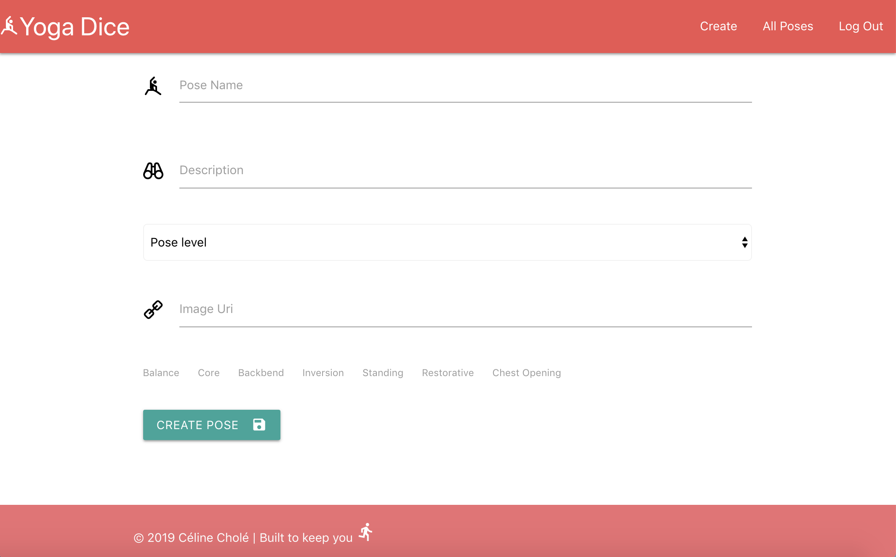
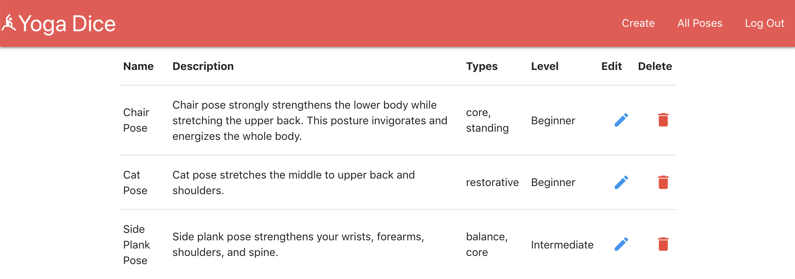
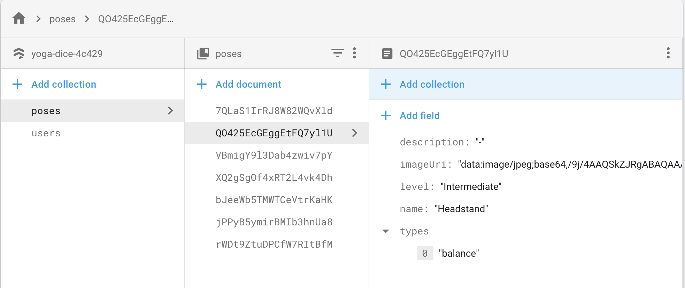

# My experience with Cloud Firestore
*Written in March 2019*

Before starting Grace Hopper I got the idea to build a very simple website to 'roll' dice and get some randomized yoga poses. The page is accessible in the [GitHub repo][Yoga Dice v1].

I built the page with Vanilla JavaScript. This was an MVP - simple and quick to build, no database, no framework - at the time this represented the sum total of my coding expertise!


Learning React, Redux, Node.js, Express and Sequelize inspired me to reimagine the website - I wanted to build v2 as a SPA backed by a database, login, and an admin section to manage pose data.

The first step was to decide which technologies to use. I stuck with React and Redux for the frontend; Redux wasn't strictly necessary for this project but I wanted to consolidate my learning and use it in a personal project.

For the backend I decided to try something new, and opted for the Google services [Firebase] and [Firestore].  In this article I will be focusing on Firestore and comparing it to my experiences with a backend of Node.js, Express, Sequelize, and Postgres.

Yoga Dice v2 is [hosted online][Yoga Dice v2] by Firebase.





## What is Firestore

Google has two database services, Realtime Database - often referred as Firebase - and Cloud Firestore, the most recent one (it went GA in Jan 2019). Firestore is the evolution, it is a realtime databse but with a different architecture that focuses on different priorities like complex querying and data integrity.

Realtime Database doesn't have any strong typing - data validation has to be written in the client side, and everything is a string in the database. Cloud Firestore has the concept of types - a huge benefit in terms of data integrity and to catch bugs due to mismatching types.

## An easy experience

1. No model to setup

Unlike Postgres, Firestore is a NoSQL database and there are no data model restrictions. Anything can be stored and it can be changed really easily.

In Postgres the schema needs to be defined upfront, in Firestore there is no such thing. Future development is more flexible and each row can have their own fields. 

As an example, if you wanted to store additional information for a pose such as the sanskrit name (indian name) it needs to be added to Postgres model and Sequelize and it will then appear everywhere. On Firestore you add it on one or more records and you're done.

With Postgres

```js
db.define("Poses", {
  name: {
    type: Sequelize.STRING,
    allowNull: false,
    validate: {
      notEmpty: true
    }
  },
  description: {
    type: Sequelize.STRING,
    allowNull: false,
    validate: {
      notEmpty: true
    }
  },
  level: {
    type: Sequelize.STRING,
    allowNull: false,
    validate: {
      notEmpty: true
    }
  },
  types: {
    type: Sequelize.STRING,
    allowNull: false,
    validate: {
      notEmpty: true,
      isIn: [['balance', 'core', 'inversion', 'standing', 'hips opening', 'restorative', 'seated']]
    }
});
```
Data modeling with Firestore



2. No API

Firestore allowed me to focus on the frontend, as there is no API route to setup.  The [React-redux-firebase] library allowed me to easily connect to Firestore by setting-up the name of the collection that I want to have access to in the store.

With Express and Sequelize

```js
router.get("/poses", async (req, res, next) => {
  try {
    const poses = await Poses.findAll();
    res.send(poses);
  } catch (error) {
    next(error);
  }
});

router.get("/poses/:id", async (req, res, next) => {
  try {
    const pose = await Poses.findOne({
      where: { id: Number(req.params.id) },
    });
    res.send(pose);
  } catch (error) {
    next(error);
  }
});
```

With Firestore

```js
const mapStateToProps = (state) => {
  return {
    poses: state.firestore.ordered.poses,
  }
}

export default compose(
  connect(mapStateToProps),
  firestoreConnect([
    { collection: 'poses' }
  ])
)(PoseList)
```

3. Realtime updates

Firestore is a realtime database; data is synced to all clients in realtime without any additional setup. It also caches the data locally and so remains available when the app loses connectivity.

Postgres isn't designed for realtime updates. In order to make it a realtime database a connector needs be used to act as realtime layer between between the servers and the clients. The persistent connection to the clients can be maintained with something like web sockets or polling - though this requires additional setup.

4. Deployment

There is no deployment with Cloud Firestore, so no need for hosting. You only need to deploy the react app whereas with the other solution you would need to deploy a database, and a server to run Node.js.

## Security

Security is really important because the client talks directly to the database, unlike an app with a Node backend where the database is normally not directly accesible to the internet.

Security rules can be directly implemented through Firebase Rules. It is a configuration document that determines what locations have restricted read/write permissions. 

For Yoga Dice v2 I have the below security rules. I created an administrator table and only users from this table are able to modify poses. Originally I included admin in the user table but I later realised that anyone using a simple program as Postman could make himself admin so I corrected this.

Anyone can create a user (we want people to be able to sign up), only logged in users can read other user's information - this is for future development, e.g. being able to see other users favorite poses.

```code
service cloud.firestore {
  match /databases/{database}/documents {
    match /poses/{pose} {
      allow read
      allow create, update, delete: if exists(/databases/$(database)/documents/userAdmins/$(request.auth.uid))
    }
    match /users/{user} {
    	allow create
      allow read: if request.auth.uid != null
      allow write: if request.auth.uid == userId
    }
    match /userAdmins/{admin} {
    	allow create, update, delete: if false
      allow read
    }
  }
}
```

## Conclusion

Using Cloud Firestore feels really nice though because of breaking changes to Redux (v5 -> v6), the update between the previous and the new version was not easy to handle - documentation was sparse.

I would be happy to use Cloud Firestore in future projects.

If I had to start again Yoga Dice instead of using Redux I would use the context API.


[Yoga Dice v1]: https://celinechole.github.io/my-yoga-dice/
[Firebase]: https://firebase.google.com/
[Firestore]: https://firebase.google.com/products/firestore/
[Yoga Dice v2]: https://linktoit
[React-redux-firebase]: https://github.com/prescottprue/react-redux-firebase
